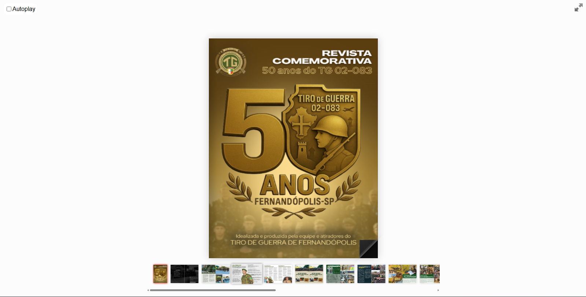

# Preview
Confira o resultado final da revista virtual do jubileu de ouro do **Tiro de Guerra de Fernandópolis!** 
###
[📲 CLIQUE AQUI: Revista comemorativa 50 anos do TG 02-083](https://jpmoncao.github.io/revista-tg02083/)
###

#

# Índice
- **Capa**
- **Contracapa**
- **[01]:** Editorial de abertura
- **[02]:** Turma do ano de 2025 🔎
- **[03]:** Inicio do ano de instrução	
- **[04-05]:** Histórico do instrutor
- **[06]:** Palavras do chefe de instrução
- **[07]:** Palavras do diretor do TG ❓
- **[08-09]:** Atiradores que seguiram carreira militar 
- **[10]:** Milton leão 
- **[11]:** **Capa:** Atividades do ano de instrução
- **[12-13]:** Estatua
- **[14-15]:** Corrida 50 anos
- **[16-17]:** Operação Alvorada
- **[18-19]:** Operação Bandeirante
- **[20-21]:** Formaturas
- **[22-23]:** Palestra nas Escolas
- **[24-25]:** VOT
- **[26]:** Semana do Soldado
- **[27]:** Marchas
- **[28-29]:** TAF
- **[30-31]:** Viagem 37 BI Mec
- **[32-33]:** Viagem ESA
- **[34-35]:** Viagem EsPCEx
- **[36-37]:** Viagem AMAN
- **[38-39]:** Viagem CAvEx
- **[40-61]:** Depoimentos
